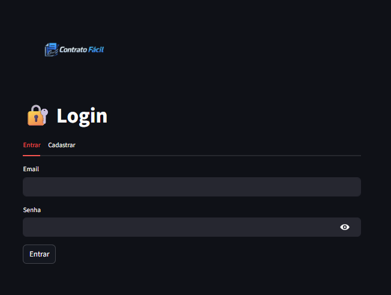
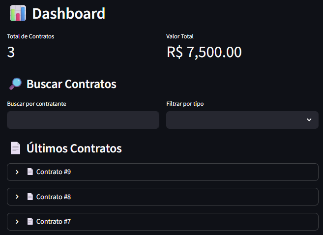
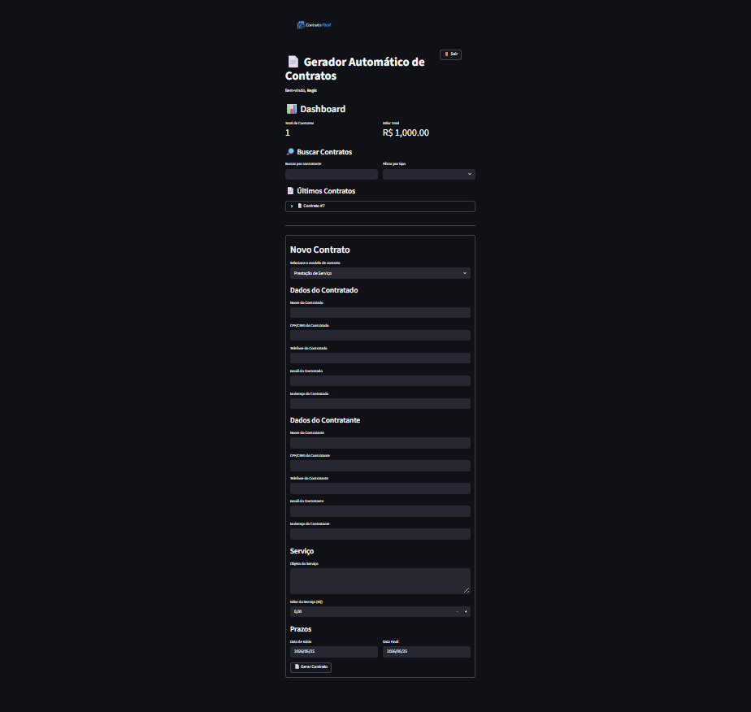
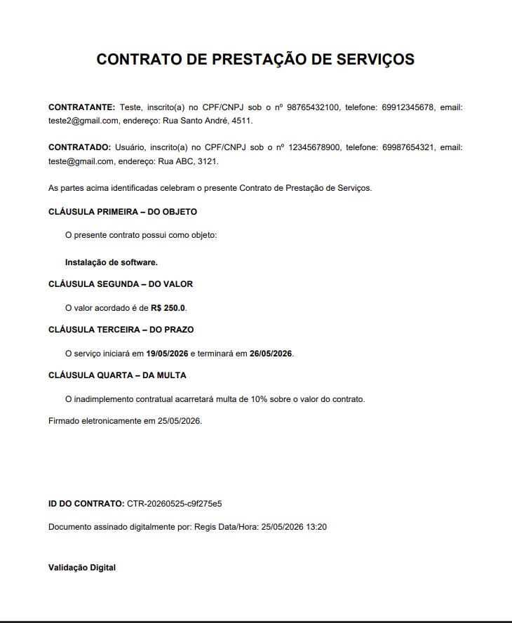
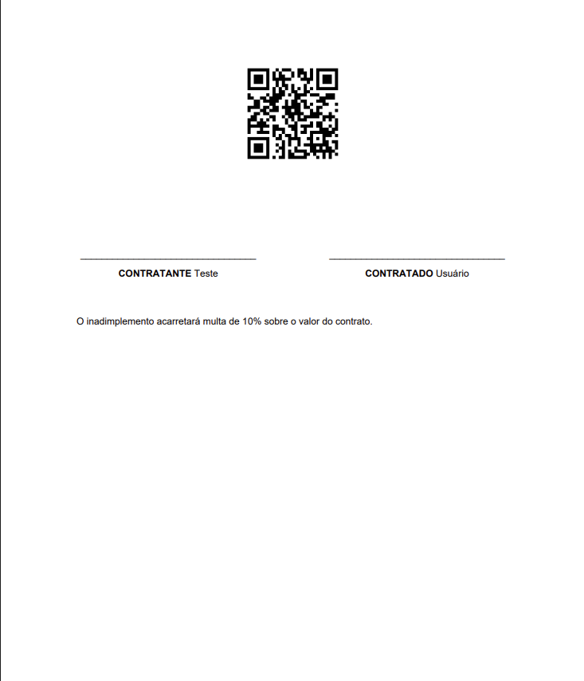

# 📄 Contrato Fácil

Sistema SaaS para geração automática de contratos profissionais em PDF, desenvolvido com Python + Streamlit.

---

## 🚀 Sobre o Projeto

O **Contrato Fácil** foi criado para ajudar:

* Autônomos
* Freelancers
* MEIs
* Prestadores de serviço
* Pequenas empresas

a gerarem contratos profissionais de forma rápida, simples e automatizada.

O sistema gera contratos em PDF com:

* cláusulas automáticas;
* proteção jurídica;
* assinatura;
* QR Code;
* múltiplos templates;
* histórico de contratos;
* autenticação de usuários.

---

# ✨ Funcionalidades

## ✅ Geração automática de contratos

* Prestação de serviço
* Freelancer
* Software
* Consultoria

---

## ✅ Exportação em PDF

* PDF profissional
* Layout corporativo
* Logo personalizada
* Assinaturas organizadas

---

## ✅ Sistema de autenticação

* Cadastro
* Login
* Sessão de usuário

---

## ✅ Dashboard

* Total de contratos
* Histórico
* Visualização de contratos

---

## ✅ Banco de Dados SQLite

* Persistência local
* Histórico por usuário

---

## ✅ QR Code de autenticação

Cada contrato possui QR Code integrado.

---

## ✅ Cláusulas jurídicas automáticas

* Multa
* Foro
* LGPD
* Confidencialidade
* Proteção contratual

---

# 🖼️ Preview do Sistema

## Tela Inicial

```md

```

---

## Dashboard

```md

```

---

## Geração de Contrato

```md

```

---

## PDF Gerado

```md


```

---

# 🛠️ Tecnologias Utilizadas

* [Python](https://www.python.org?utm_source=chatgpt.com)
* [Streamlit](https://streamlit.io?utm_source=chatgpt.com)
* [ReportLab](https://www.reportlab.com?utm_source=chatgpt.com)
* [SQLite](https://www.sqlite.org?utm_source=chatgpt.com)
* [qrcode](https://pypi.org/project/qrcode/?utm_source=chatgpt.com)

---

# 📂 Estrutura do Projeto

```bash
contrato-facil/
│
├── assets/
├── database/
├── legal/
├── services/
├── templates/
├── utils/
│
├── main.py
├── requirements.txt
├── README.md
└── .gitignore
```

---

# ⚙️ Como Executar o Projeto

## 1️⃣ Clonar o repositório

```bash
git clone https://github.com/SEUUSUARIO/contrato-facil.git
```

---

## 2️⃣ Entrar na pasta

```bash
cd contrato-facil
```

---

## 3️⃣ Criar ambiente virtual

### Windows

```bash
python -m venv venv
```

---

## 4️⃣ Ativar ambiente virtual

### Windows

```bash
venv\Scripts\activate
```

---

## 5️⃣ Instalar dependências

```bash
pip install -r requirements.txt
```

---

## 6️⃣ Executar projeto

```bash
streamlit run main.py
```

---

# 📦 Dependências Principais

```txt
streamlit
reportlab
qrcode
pillow
```

---

# 🔐 Segurança

O sistema:

* não armazena senhas em texto puro;
* utiliza autenticação;
* organiza contratos por usuário;
* gera contratos únicos.

---

# 🚧 Roadmap

## Próximas melhorias

* [ ] Assinatura eletrônica real
* [ ] Integração com e-mail
* [ ] Deploy em nuvem
* [ ] PostgreSQL
* [ ] IA para cláusulas automáticas
* [ ] Editor visual de contratos
* [ ] Tema premium
* [ ] API pública

---

# 👨‍💻 Desenvolvedor

Desenvolvido por **Junior Cardoso** 🚀

---

# 📄 Licença

Este projeto está sob licença MIT.

---

# ⭐ Contribuição

Sinta-se à vontade para:

* abrir issues;
* sugerir melhorias;
* contribuir com o projeto.

---

# 🌐 Futuro do Projeto

O objetivo do **Contrato Fácil** é evoluir para uma plataforma SaaS completa de automação contratual para profissionais autônomos e pequenas empresas.
